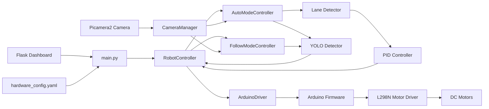

# Raspberry Pi + Arduino Autonomous Mini Car

Camera-based lane following, model-assisted perception, and distributed motor control for a compact autonomous robotics platform.

> Suggested GitHub About: Camera-based autonomous mini car using Raspberry Pi + Arduino distributed control, PID lane following, and Flask monitoring tools.

## Why This Project Stands Out

This repository is a good embedded/robotics portfolio project because it combines:

- computer vision on Raspberry Pi
- real motor actuation through Arduino + L298N
- PID-based control loops
- serial protocol design
- live monitoring and calibration dashboards
- safety mechanisms such as watchdog-based stop behavior

## Demo


| Placeholder | Suggested content |
| --- | --- |
| `docs/assets/demo_dashboard.png` | Main dashboard during a live run |
| `docs/assets/lane_detection_debug.png` | Lane overlay / calibration screenshot |
| `docs/assets/hardware_setup.jpg` | Labeled chassis and wiring photo |
| `docs/assets/system_architecture.png` | Final annotated architecture diagram |

For the best recruiter-facing presentation, capture:


## Key Features

- Distributed control architecture with Raspberry Pi for perception and Arduino Uno for motor actuation
- Camera-based lane following with ROI, Canny, Hough, and PID steering correction
- Vision-based follow mode using YOLO detections filtered by target color classes
- Traffic sign reaction logic in auto mode, based on detected sign class and bounding-box size thresholds
- Flask + Socket.IO dashboard for video, runtime state, logs, and speed control
- Separate calibration/tuning tools for lane parameters, follow target size, and auto sign thresholds
- Watchdog safety on both the Raspberry Pi controller side and Arduino firmware side

## What Is Implemented Today

| Capability | Status | Notes |
| --- | --- | --- |
| Autonomous lane following | Implemented | Main `auto` mode in `main.py` |
| Color/object follow mode | Implemented | Requires YOLO model assets |
| Traffic sign handling | Implemented, model-dependent | Triggered in `AutoModeController` |
| Dashboard start/stop + speed control | Implemented | Main runtime dashboard on port `5000` |
| Manual directional teleoperation | Not exposed in current runtime | No `/forward`, `/backward`, `/left`, `/right` routes in `main.py` |
| IMU-assisted turning | Optional / fallback-aware | Uses MPU-6050 if present, time-based fallback otherwise |

## System Overview



## Hardware Architecture

| Layer | Main components | Responsibility |
| --- | --- | --- |
| Compute | Raspberry Pi 5 | Perception, UI, configuration, high-level control |
| Vision | Pi Camera | Live video for lane following and model-assisted detection |
| Actuation bridge | Arduino Uno | Serial command handling and motor PWM/direction output |
| Power stage | L298N | Drives left and right DC motors |
| Optional sensing | MPU-6050 | IMU feedback for smart turning |

More detail: [docs/HARDWARE.md](docs/HARDWARE.md)

## Software Architecture

| Area | Main files |
| --- | --- |
| Runtime entry point | `main.py` |
| Control | `control/robot_controller.py`, `control/pid_controller.py` |
| Perception | `perception/camera_manager.py`, `perception/lane_detector.py`, `perception/object_detector.py` |
| Motor interface | `drivers/motor/arduino_driver.py` |
| Firmware | `arduino_firmware/arduino_firmware.ino` |
| Main dashboard UI | `templates/index.html`, `static/js/app.js`, `static/css/style.css` |
| Calibration/tuning | `dashboard_server.py`, `test_follow.py`, `test_mode_auto.py`, `calibrate_fixed.py` |

Full architecture notes: [docs/ARCHITECTURE.md](docs/ARCHITECTURE.md)

## Control Modes

### Dashboard-assisted runtime control

The main dashboard currently supports:

- switching between `auto`, `follow`, and `idle`
- changing speed
- emergency stop
- live video and log monitoring

### Manual control through web dashboard

Status:

- not currently implemented as directional teleoperation in the active `main.py` runtime

What exists instead:

- start/stop and mode-selection controls
- speed control
- monitoring and debug feeds

### Autonomous lane following

Implemented in `AutoModeController` with:

- lane detection from the Pi camera
- PID steering correction
- lane-loss recovery behavior

### Color/object following

Implemented in `FollowModeController` if model assets are present. The current code filters detections by color-class names such as:

- `red_color`
- `green_color`
- `blue_color`
- `yellow_color`

### Traffic sign detection

Implemented in the auto controller as model-assisted behavior, not as a separately packaged perception service. The current code contains reactions for classes such as:

- `stop_sign`
- `red_light`
- `green_light`
- `left_turn_sign`
- `right_turn_sign`
- `speed_limit_signs`
- `parking_signs`

This path depends on the external YOLO model files being available.

## Tech Stack

| Category | Technologies |
| --- | --- |
| Runtime | Python |
| Web UI | Flask, Flask-SocketIO, MJPEG streaming |
| Vision | OpenCV, Picamera2 |
| Detection | Ultralytics YOLO (NCNN model path expected by code) |
| Control | PID controller, watchdog logic |
| Embedded | Arduino Uno firmware, JSON serial protocol |
| Configuration | YAML |

## Repository Structure

```text
.
|- README.md
|- main.py
|- dashboard_server.py
|- test_follow.py
|- test_mode_auto.py
|- calibrate_fixed.py
|- arduino_firmware/
|- config/
|- control/
|- docs/
|- drivers/
|- perception/
|- review_tool/
|- static/
|- templates/
|- tests/
|- tools/
`- utils/
```

## Hardware Requirements

### Required

- Raspberry Pi 5
- Arduino Uno
- L298N motor driver
- 2x DC motors
- Raspberry Pi camera
- motor battery / power rail
- stable 5 V supply for the Pi
- chassis and wheels

### Optional

- MPU-6050 IMU
- additional power-distribution hardware
- encoder-equipped motors

Detailed bill of materials and wiring notes: [docs/HARDWARE.md](docs/HARDWARE.md)

## Software Requirements

### Base runtime

- Raspberry Pi OS or compatible Linux environment for the Pi runtime
- Python 3
- virtual environment support
- Arduino IDE for firmware upload

### Additional packages for optional features

The current source imports some packages that are not listed in `requirements.txt`:

- `ultralytics`
- `smbus2`
- `matplotlib`

That matters if you plan to use:

- YOLO-based follow/sign features
- MPU-6050 support
- PID plot tooling

## Installation Guide

Basic setup:

```bash
git clone <your-repo-url>
cd Viet
python3 -m venv .venv
source .venv/bin/activate
pip install -r requirements.txt
```

Optional feature packages:

```bash
pip install ultralytics smbus2 matplotlib
```

Full bring-up guide: [docs/SETUP.md](docs/SETUP.md)

## Configuration Guide

The main configuration lives in:

- [`config/hardware_config.yaml`](config/hardware_config.yaml)

Review these sections before the first run:

- `arduino.port`
- `sensors.camera`
- `ai.lane_detection`
- `lane_following.pid`
- `follow_mode`

## How To Run

### Main robot runtime

```bash
python main.py
```

Access:

- `http://<raspberry-pi-ip>:5000`

### Lane tuning dashboard

```bash
python dashboard_server.py
```

Access:

- `http://<raspberry-pi-ip>:5001`

### Follow target tuner

```bash
python test_follow.py --port 5003
```

Why `5003` here:

- `test_follow.py` defaults to `5001`
- `dashboard_server.py` also defaults to `5001`

### Auto sign-size tuner

```bash
python test_mode_auto.py
```

Access:

- `http://<raspberry-pi-ip>:5002`

## API Endpoints

Main runtime highlights:

| Endpoint | Purpose |
| --- | --- |
| `/` | Main dashboard |
| `/video_feed` | Camera MJPEG stream |
| `/debug_feed` | Debug MJPEG stream |
| `/set_mode?mode=auto` | Start lane-following mode |
| `/set_mode?mode=follow` | Start follow mode |
| `/set_follow_color?color=red` | Change follow target color |
| `/set_speed?value=120` | Adjust speed |
| `/stop` | Return to idle |
| `/emergency_stop` | Immediate stop |
| `/read_log` | Read log file |
| `/clear_log` | Clear log file |

Full API documentation: [docs/API.md](docs/API.md)

## Calibration Workflow

Recommended sequence:

1. Run `review_tool/test_camera.py`
2. Capture a representative frame
3. Calibrate `lane_width_pixels`
4. Tune live lane parameters in `dashboard_server.py`
5. Tune PID gains at low speed
6. Validate on the actual track

Full guide: [docs/CALIBRATION.md](docs/CALIBRATION.md)

## Testing Workflow

Recommended order:

1. Camera test
2. Arduino serial test
3. Lane detection test
4. PID sanity test
5. Motor test
6. Full integration test

Testing details: [docs/TESTING.md](docs/TESTING.md)

## Known Limitations

- Manual directional teleoperation is not exposed in the main runtime.
- YOLO model assets are not included in this workspace.
- `requirements.txt` does not currently list every optional dependency used by the code.
- `tests/test_robot_logic.py` references a missing `tune_lane_web` module.
- `tools/calibrate_vo.py` references a missing `perception.visual_odometry` module.
- `tools/test_motor.py` expects a missing direct-GPIO `l298n_driver.py`.
- `tools/test_yolo_ncnn.py` uses a model path convention different from the main runtime.

These are good talking points in an interview if presented as active cleanup opportunities rather than hidden.

## Future Improvements

- package model assets or document them more cleanly
- unify tuning dashboards and port defaults
- clean up stale tests and legacy scripts
- add richer telemetry and validation
- expand perception robustness under changing lighting

Roadmap: [docs/ROADMAP.md](docs/ROADMAP.md)

## What I Learned / Engineering Highlights

- Building robotics software means solving concurrency problems, not just perception problems. Shared camera access, live streaming, and control loops must coexist cleanly.
- A simple serial protocol plus watchdog logic can be a strong architecture for small robots because it keeps actuation predictable while letting the Pi focus on perception.
- Classical CV still has real value in robotics portfolios when calibration, failure modes, and controller tuning are documented honestly.
- Small inconsistencies across tooling, dependencies, and ports become very visible in physical systems, which makes documentation quality part of engineering quality.

## Portfolio Highlights

- Practical embedded AI project that spans perception, control, firmware, and operator tooling
- Recruiter-friendly architecture: Pi for brains, Arduino for actuation
- Clear examples of PID tuning, serial protocol design, and hardware/software integration
- Good foundation for internships or junior roles in robotics, embedded systems, controls, or applied computer vision

Portfolio copy-ready summary: [docs/PORTFOLIO_SUMMARY.md](docs/PORTFOLIO_SUMMARY.md)

## Suggested Repository Topics

`raspberry-pi`, `arduino`, `autonomous-car`, `computer-vision`, `pid-controller`, `flask-dashboard`, `robotics`, `embedded-systems`

## Author

Vo Van Tuan
