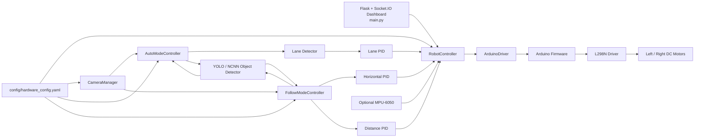
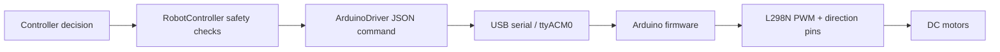
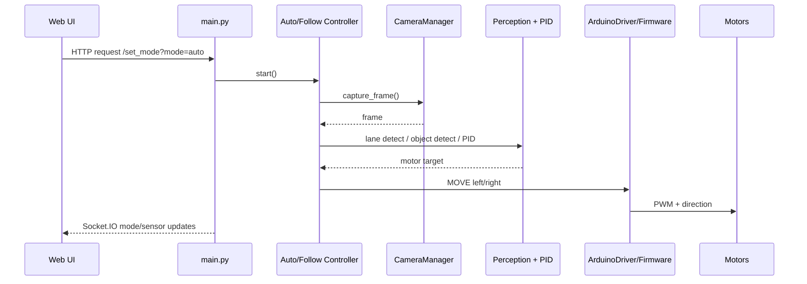

# Architecture

## Purpose
This project uses a distributed robotics architecture:

- A Raspberry Pi runs perception, high-level control logic, and the web UI.
- An Arduino Uno acts as a motor-control coprocessor over serial.
- A Pi camera provides the primary perception input for lane following and model-assisted object/sign detection.

The source code still uses the older internal name `LogisticsBot` in several files. This document describes the current implementation, not the historical naming.

## High-Level Design

## Raspberry Pi Role

The Raspberry Pi is the main compute node and owns:

- Flask + Socket.IO dashboard hosting in [`main.py`](../main.py)
- Picamera2 lifecycle and shared frame access in [`perception/camera_manager.py`](../perception/camera_manager.py)
- Lane detection in [`perception/lane_detector.py`](../perception/lane_detector.py)
- YOLO-based detection in [`perception/object_detector.py`](../perception/object_detector.py)
- High-level robot state management in [`control/robot_controller.py`](../control/robot_controller.py)
- Runtime configuration via [`config/hardware_config.yaml`](../config/hardware_config.yaml)

In practice, the Pi decides what the robot should do, while the Arduino executes low-level motor commands safely.

## Arduino Role

The Arduino firmware in [`arduino_firmware/arduino_firmware.ino`](../arduino_firmware/arduino_firmware.ino) is intentionally small:

- Receives JSON commands such as `MOVE`, `STOP`, and `PING`
- Drives the L298N pins for left and right motors
- Maintains a watchdog timeout so motors stop if the Pi stops sending commands
- Reports simple status acknowledgements back over serial

The current firmware is a camera-only build. Older documents describing IR line sensors and ultrasonic sensing do not match the active firmware in this repository.

## Camera and Perception Pipeline

### Shared camera access

The project uses a shared camera object rather than opening the camera separately in each mode:

1. `CameraManager` starts Picamera2 with settings from `hardware_config.yaml`.
2. Frames are captured once and reused for web streaming and control loops.
3. Raw YUV420 frames can be passed directly into lane detection to reduce conversion overhead.
4. BGR conversion is used when a mode needs a standard OpenCV frame or YOLO inference.

### Lane following path

1. `AutoModeController` captures a frame.
2. `detect_line(...)` estimates lane center relative to camera center.
3. The lane error is low-pass filtered.
4. `PIDController.compute(...)` produces steering correction.
5. Left and right motor commands are derived from `base_speed +/- correction`.
6. Commands are sent through `RobotController.safe_set_motors(...)`.

The lane detector is tuned for dark tape / dark lane markings on a light floor and uses:

- ROI cropping
- grayscale inversion
- Gaussian blur
- CLAHE contrast enhancement
- Canny edges
- Hough line fitting

### Model-assisted perception path

YOLO detection is used in two places:

- `AutoModeController` uses detections for traffic sign reaction logic
- `FollowModeController` filters detections by color-class names such as `red_color`

Important implementation detail:

- The repo expects model files under `models/best_ncnn_model` in the main runtime.
- `tools/test_yolo_ncnn.py` uses `data/models/best_ncnn_model`, which is a separate path convention and should be treated as a legacy inconsistency.

## Motor Control Pipeline

The motor path deliberately separates concerns:

- Pi handles planning and perception
- Arduino handles electrical actuation
- watchdogs exist on both sides of the interface

## PID Controller Flow

### Lane following PID

The lane controller in [`control/pid_controller.py`](../control/pid_controller.py) provides:

- proportional, integral, and derivative terms
- anti-windup through integral clamping
- output limits
- derivative smoothing

`AutoModeController` computes:

- `error = lane_x - frame_center + camera_offset`
- `correction = pid.compute(filtered_error, dt)`
- `left_speed = base_speed - correction`
- `right_speed = base_speed + correction`

### Follow mode PID

`FollowModeController` uses two PID loops:

- Horizontal PID recenters the object in the frame
- Distance PID drives forward or backward based on target size

This is a useful design choice for a portfolio project because it shows that the project distinguishes heading error from range error instead of collapsing everything into a single heuristic.

## Web Dashboard Interaction

The primary operator-facing UI is the Flask dashboard in [`main.py`](../main.py):

- HTTP routes handle mode switching, speed changes, logs, and MJPEG video streams
- Socket.IO events push mode, sensor, target, and log updates to the frontend
- The dashboard is designed for monitoring and starting automated modes, not for direct directional teleoperation

Current mode support in the runtime:

- `auto`: active
- `follow`: active
- `idle`: active
- manual directional driving: not exposed in current `main.py`

Additional tuning surfaces exist:

- [`dashboard_server.py`](../dashboard_server.py) for lane parameter tuning
- [`test_follow.py`](../test_follow.py) for follow-target size tuning
- [`test_mode_auto.py`](../test_mode_auto.py) for sign-size threshold tuning

## Data and Control Flow

## Design Decisions and Trade-Offs

### Why split Pi and Arduino?

Benefits:

- cleaner separation between perception and actuation
- serial interface is easy to debug
- Arduino watchdog provides a second safety layer

Trade-offs:

- more moving parts
- serial latency and disconnect handling must be managed
- two firmware/software environments must stay aligned

### Why keep lane detection classical instead of fully learned?

Benefits:

- lower compute cost
- tunable on-device with simple parameters
- easier to explain in an interview

Trade-offs:

- more sensitive to lighting, track material, and camera position
- less robust than a well-trained end-to-end perception model

### Why use separate tuning dashboards?

Benefits:

- fast iteration during calibration
- easier to isolate lane and object-following thresholds from the main runtime

Trade-offs:

- duplicated Flask surfaces
- default port conflicts can occur because `dashboard_server.py` and `test_follow.py` both default to port `5001`

### Why keep IMU optional?

The code supports IMU-assisted `smart_turn(...)`, but gracefully falls back to time-based turning if the MPU-6050 is missing. That improves portability while still showing a path toward richer sensor fusion.

## Current Architecture Gaps

These are worth knowing before presenting the project:

- Model assets are not included in this workspace, so sign handling and follow mode depend on external files.
- `tests/test_robot_logic.py` imports a missing module named `tune_lane_web`.
- `tools/calibrate_vo.py` imports `perception.visual_odometry`, which is not present.
- `tools/test_motor.py` expects a missing `drivers/motor/l298n_driver.py`.

Those gaps do not invalidate the main architecture, but they should be presented honestly as cleanup opportunities rather than ignored.
